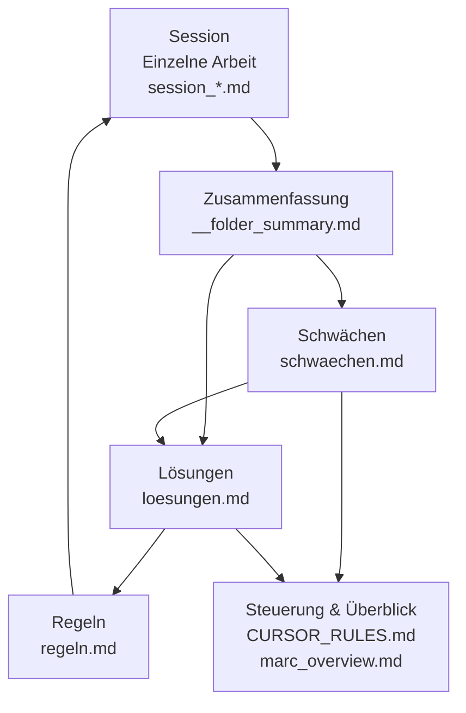

# md-architecture-visual.md

## Zweck dieses Dokuments

Dieses Dokument erklärt die MD-Wissensarchitektur **visuell und in Alltagssprache**.

Es richtet sich an:
- Menschen ohne Software- oder Architekturkenntnisse
- neue Leser:innen
- zukünftige Mitwirkende

Es erklärt **wie die Dokumente zusammenarbeiten**, nicht wie man sie schreibt.

---

## Die Grundidee (ohne Technik)

> **Alles beginnt mit einzelnen Arbeitsschritten.**  
> Diese werden gesammelt, verglichen, daraus werden Muster erkannt,
> daraus entstehen Verbesserungen – und diese steuern zukünftige Arbeit.

Man kann sich das System wie einen **Lernkreislauf** vorstellen.

---

## Visuelles Gesamtbild (vereinfacht)



---

## Erklärung der Bausteine

### 1️⃣ Sessions – die einzelnen Bausteine

**Was ist das?**  
Eine Session ist ein einzelner Arbeitsschritt oder Gedankengang.

Beispiele:
- ein Coding-Task
- eine Diskussion
- ein Problem

**Wichtig:**
- keine Bewertung
- keine Schuld
- nur festhalten, was passiert ist

---

### 2️⃣ Zusammenfassung – der Überblick

Mehrere Sessions werden gemeinsam betrachtet.

Hier wird erkannt:
- was sich wiederholt
- wo Ähnlichkeiten auftreten

Noch **keine** Schwäche, nur Beobachtung.

---

### 3️⃣ Schwächen – Muster erkennen

Schwächen sind **keine Fehler**, sondern:
- wiederkehrende Muster
- systematische Probleme
- menschliche oder technische Ursachen

Beispiele:
- Ziele oft zu spät klar
- zu viel Kontext auf einmal

---

### 4️⃣ Lösungen – besser machen

Für jede Schwäche werden konkrete Verbesserungen formuliert:
- Vergleich *Ist* vs. *Soll*
- konkrete Maßnahmen
- ggf. Verweise auf Code oder Struktur

---

### 5️⃣ Regeln – Stabilität schaffen

Regeln sorgen dafür, dass:
- bekannte Probleme nicht ständig wieder auftreten
- Qualität nicht vom Zufall abhängt

Regeln steuern **zukünftige Sessions**.

---

### 6️⃣ Steuerung & Überblick

Diese Ebene zeigt:
- Lernfortschritt
- offene Themen
- Fokusbereiche

Sie hilft bei langfristiger Entwicklung.

---

## Der Lernkreislauf (Merksatz)

```text
Arbeiten → Aufschreiben → Vergleichen → Verstehen → Verbessern → Besser arbeiten
```

---

## Warum dieses System funktioniert

- Menschen lernen aus Mustern, nicht aus Einzelfällen
- Trennung von Beobachtung & Bewertung verhindert Verzerrung
- Explizite Regeln entlasten Denken

---

## Rolle dieses Dokuments

Dieses Dokument ist:
- Einstiegspunkt
- Erklärhilfe
- visuelle Referenz

Es ergänzt die Architektur, ersetzt sie aber nicht.
