# UML-Diagramm: Datenbankstruktur Ernährbär

**Stand:** 2026-01-24  
**Zweck:** Vollständiges UML-Klassendiagramm mit allen Beziehungen (1:1, 1:N, N:M)

---

## 🔍 Kritische Analyse

### ❌ Fehlende Tabellen

1. **`ShoppingLists` / `ShoppingListItems`** – Einkaufsliste fehlt komplett!
   - Frontend existiert (`/shopping-list`), aber keine DB-Struktur
   - Benötigt: Aggregation von Zutaten aus MealPlanEntries

2. **`Files` / `Attachments`** – Zentrale File-Verwaltung fehlt!
   - Aktuell: Nur `Recipe.ImageUrl` und `Recipe.PdfUrl` als Strings
   - Problem: Keine Metadaten, keine User-Referenz, keine Versionierung
   - Empfehlung: Zentrale `File`-Tabelle mit S3-Pfad, Metadaten, User-Referenz

---

## 📊 UML-Klassendiagramm (Mermaid)

```mermaid
erDiagram
    %% Multi-Tenant & User-Management
    Groups ||--o{ GroupMembers : "has"
    Users ||--o{ GroupMembers : "belongs to"
    Groups ||--o{ GroupInvites : "has"
    Users ||--o{ GroupInvites : "created by"
    
    %% Rezepte
    Groups ||--o{ Recipes : "owns"
    Recipes ||--o{ RecipeIngredients : "contains"
    Recipes ||--o{ RecipeTags : "has"
    Tags ||--o{ RecipeTags : "tagged with"
    Groups ||--o{ Tags : "owns"
    Recipes ||--o{ RecipeRatings : "rated by"
    Users ||--o{ RecipeRatings : "rates"
    Recipes ||--|| NutritionInfos : "has"
    Recipes ||--o{ MealPlanEntries : "used in"
    
    %% Wochenpläne
    Groups ||--o{ MealPlans : "owns"
    MealPlans ||--o{ MealPlanEntries : "contains"
    
    %% Review & Upload
    Groups ||--o{ RecipeDrafts : "has"
    Users ||--o{ RecipeDrafts : "created by"
    Users ||--o{ RecipeDrafts : "reviewed by"
    Users ||--o{ UploadTasks : "uploaded by"
    Groups ||--o{ UploadTasks : "belongs to"
    UploadTasks ||--o| RecipeDrafts : "creates"
    
    %% Notifications
    Users ||--o{ Notifications : "receives"
    
    %% Files (NEU - empfohlen)
    Users ||--o{ Files : "uploaded by"
    Groups ||--o{ Files : "belongs to"
    Recipes ||--o{ Files : "has"
    RecipeDrafts ||--o{ Files : "has"
    
    %% Shopping Lists (NEU - empfohlen)
    Groups ||--o{ ShoppingLists : "has"
    Users ||--o{ ShoppingLists : "created by"
    ShoppingLists ||--o{ ShoppingListItems : "contains"
    RecipeIngredients ||--o{ ShoppingListItems : "references"
    
    %% Entity-Definitionen
    Groups {
        int Id PK
        string Name
        string Description
        DateTime CreatedAt
        DateTime UpdatedAt
    }
    
    Users {
        int Id PK
        string SupabaseUserId UK
        string Email
        string DisplayName
        DateTime CreatedAt
        DateTime UpdatedAt
    }
    
    GroupMembers {
        int Id PK
        int UserId FK
        int GroupId FK
        GroupRole Role
        DateTime JoinedAt
        DateTime CreatedAt
        DateTime UpdatedAt
    }
    
    GroupInvites {
        int Id PK
        int GroupId FK
        string Token UK
        string InvitedEmail
        int CreatedByUserId FK
        DateTime ExpiresAt
        bool IsUsed
        DateTime UsedAt
        DateTime CreatedAt
        DateTime UpdatedAt
    }
    
    Recipes {
        int Id PK
        int GroupId FK
        string Name
        string Description
        string Instructions
        string ImageUrl
        string PdfUrl
        int Servings
        int PreparationTimeMinutes
        int CookingTimeMinutes
        RecipeSource Source
        MealCategory MealCategory
        int RepeatCycleWeeks
        DateTime CreatedAt
        DateTime UpdatedAt
    }
    
    RecipeIngredients {
        int Id PK
        int RecipeId FK
        string Name
        decimal Quantity
        string Unit
        string Notes
        int Order
        DateTime CreatedAt
        DateTime UpdatedAt
    }
    
    Tags {
        int Id PK
        int GroupId FK
        string Name
        TagCategory Category
        DateTime CreatedAt
        DateTime UpdatedAt
    }
    
    RecipeTags {
        int Id PK
        int RecipeId FK
        int TagId FK
        DateTime CreatedAt
        DateTime UpdatedAt
    }
    
    RecipeRatings {
        int Id PK
        int RecipeId FK
        int UserId FK
        int Rating
        bool IsFavorite
        string Comment
        DateTime CreatedAt
        DateTime UpdatedAt
    }
    
    NutritionInfos {
        int Id PK
        int RecipeId FK "UK"
        decimal Calories
        decimal Protein
        decimal Carbohydrates
        decimal Fat
        decimal Fiber
        decimal Sugar
        decimal Sodium
        DateTime CreatedAt
        DateTime UpdatedAt
    }
    
    MealPlans {
        int Id PK
        int GroupId FK
        DateTime StartDate
        DateTime EndDate
        string Name
        string GenerationPrompt
        MealPlanStatus Status
        DateTime CreatedAt
        DateTime UpdatedAt
    }
    
    MealPlanEntries {
        int Id PK
        int MealPlanId FK
        DateTime Date
        MealCategory MealCategory
        int RecipeId FK "nullable"
        string CustomMealName
        int DayNumber
        DateTime CreatedAt
        DateTime UpdatedAt
    }
    
    RecipeDrafts {
        int Id PK
        int GroupId FK
        DraftStatus Status
        RecipeSource Source
        string OriginalData
        int CreatedByUserId FK
        int ReviewedByUserId FK "nullable"
        DateTime ReviewedAt
        string Name
        string Description
        string Instructions
        MealCategory MealCategory
        DateTime CreatedAt
        DateTime UpdatedAt
    }
    
    Notifications {
        int Id PK
        int UserId FK
        NotificationType Type
        string Message
        bool IsRead
        DateTime ReadAt
        string ActionLink
        DateTime CreatedAt
        DateTime UpdatedAt
    }
    
    UploadTasks {
        int Id PK
        int UserId FK
        int GroupId FK
        string FileName
        string FilePath
        TaskStatus Status
        string Error
        int RecipeDraftId FK "nullable"
        DateTime CreatedAt
        DateTime UpdatedAt
    }
    
    Files {
        int Id PK
        int GroupId FK
        int UploadedByUserId FK
        string FileName
        string FilePath "S3/Supabase path"
        string ContentType
        long FileSizeBytes
        FileType Type "Image, Pdf, Other"
        int RecipeId FK "nullable"
        int RecipeDraftId FK "nullable"
        DateTime CreatedAt
        DateTime UpdatedAt
    }
    
    ShoppingLists {
        int Id PK
        int GroupId FK
        int CreatedByUserId FK
        string Name
        DateTime ForWeekStartDate
        DateTime ForWeekEndDate
        bool IsCompleted
        DateTime CompletedAt
        DateTime CreatedAt
        DateTime UpdatedAt
    }
    
    ShoppingListItems {
        int Id PK
        int ShoppingListId FK
        int RecipeIngredientId FK "nullable"
        string IngredientName
        decimal Quantity
        string Unit
        bool IsChecked
        int Order
        DateTime CreatedAt
        DateTime UpdatedAt
    }
```



---

## 🔗 Beziehungen im Detail

### 1:1 Beziehungen
- `Recipes` ↔ `NutritionInfos` (1:1, optional)

### 1:N Beziehungen
- `Groups` → `Recipes` (1:N)
- `Groups` → `MealPlans` (1:N)
- `Groups` → `Tags` (1:N)
- `Groups` → `GroupMembers` (1:N)
- `Groups` → `GroupInvites` (1:N)
- `Recipes` → `RecipeIngredients` (1:N)
- `Recipes` → `RecipeTags` (1:N)
- `Recipes` → `RecipeRatings` (1:N)
- `MealPlans` → `MealPlanEntries` (1:N)
- `ShoppingLists` → `ShoppingListItems` (1:N)

### N:M Beziehungen
- `Recipes` ↔ `Tags` (N:M via `RecipeTags`)
- `Users` ↔ `Recipes` (N:M via `RecipeRatings` - Bewertungen/Favoriten)
- `Users` ↔ `Groups` (N:M via `GroupMembers`)

---

## 📋 Neue Tabellen: Detaillierte Spezifikation

### `Files` (NEU - empfohlen)

**Zweck:** Zentrale Verwaltung aller hochgeladenen Dateien (PDFs, Bilder)

| Spalte | Typ | Beschreibung |
|--------|-----|--------------|
| `Id` | int (PK) | Primärschlüssel |
| `GroupId` | int (FK) | Foreign Key zu `Groups` |
| `UploadedByUserId` | int (FK) | User, der hochgeladen hat |
| `FileName` | string | Original-Dateiname |
| `FilePath` | string | S3/Supabase Storage-Pfad |
| `ContentType` | string | MIME-Type (z.B. "image/png", "application/pdf") |
| `FileSizeBytes` | long | Dateigröße in Bytes |
| `Type` | FileType | Image, Pdf, Other |
| `RecipeId` | int? (FK) | Foreign Key zu `Recipes` (nullable) |
| `RecipeDraftId` | int? (FK) | Foreign Key zu `RecipeDrafts` (nullable) |
| `CreatedAt` | DateTime | Erstellungsdatum |
| `UpdatedAt` | DateTime | Letzte Änderung |

**Enum:**
```csharp
public enum FileType
{
    Image = 1,  // PNG, JPG, etc.
    Pdf = 2,    // PDF
    Other = 3   // Sonstige
}
```

**Navigation:**
- `Group` → `Group`
- `UploadedByUser` → `User`
- `Recipe` → `Recipe?` (nullable)
- `RecipeDraft` → `RecipeDraft?` (nullable)

**Vorteile:**
- Zentrale File-Verwaltung
- Metadaten (Größe, Content-Type)
- User-Referenz (wer hat hochgeladen?)
- Versionierung möglich
- Löschung von ungenutzten Files einfacher

**Migration:** `Recipe.ImageUrl` und `Recipe.PdfUrl` → `Files` Tabelle migrieren

---

### `ShoppingLists` (NEU - empfohlen)

**Zweck:** Einkaufslisten pro Group/Woche

| Spalte | Typ | Beschreibung |
|--------|-----|--------------|
| `Id` | int (PK) | Primärschlüssel |
| `GroupId` | int (FK) | Foreign Key zu `Groups` |
| `CreatedByUserId` | int (FK) | User, der erstellt hat |
| `Name` | string | Name der Liste (z.B. "Woche 1/2026") |
| `ForWeekStartDate` | DateTime | Startdatum der Woche |
| `ForWeekEndDate` | DateTime | Enddatum der Woche |
| `IsCompleted` | bool | Abgeschlossen? |
| `CompletedAt` | DateTime? | Abgeschlossen-Datum |
| `CreatedAt` | DateTime | Erstellungsdatum |
| `UpdatedAt` | DateTime | Letzte Änderung |

**Navigation:**
- `Group` → `Group`
- `CreatedByUser` → `User`
- `Items` → `ShoppingListItem[]`

---

### `ShoppingListItems` (NEU - empfohlen)

**Zweck:** Einzelne Zutaten in einer Einkaufsliste

| Spalte | Typ | Beschreibung |
|--------|-----|--------------|
| `Id` | int (PK) | Primärschlüssel |
| `ShoppingListId` | int (FK) | Foreign Key zu `ShoppingLists` |
| `RecipeIngredientId` | int? (FK) | Foreign Key zu `RecipeIngredients` (nullable, für Referenz) |
| `IngredientName` | string | Zutatenname (denormalisiert, für Flexibilität) |
| `Quantity` | decimal? | Aggregierte Menge |
| `Unit` | string? | Einheit |
| `IsChecked` | bool | Abgehakt? |
| `Order` | int | Reihenfolge |
| `CreatedAt` | DateTime | Erstellungsdatum |
| `UpdatedAt` | DateTime | Letzte Änderung |

**Navigation:**
- `ShoppingList` → `ShoppingList`
- `RecipeIngredient` → `RecipeIngredient?` (nullable, Referenz)

**Logik:**
- Aggregation aus `MealPlanEntries` → `Recipes` → `RecipeIngredients`
- Mehrere Rezepte mit gleicher Zutat → `Quantity` wird summiert
- `RecipeIngredientId` ist optional (kann auch manuell hinzugefügt werden)

---

## 🔄 Aktualisierte Beziehungen (mit neuen Tabellen)

```
Groups (1) ──< (N) GroupMembers (N) >── (1) Users
Groups (1) ──< (N) Recipes
Groups (1) ──< (N) MealPlans
Groups (1) ──< (N) Tags
Groups (1) ──< (N) GroupInvites
Groups (1) ──< (N) Files
Groups (1) ──< (N) ShoppingLists

Recipes (1) ──< (N) RecipeIngredients
Recipes (1) ──< (N) RecipeTags (N) >── (1) Tags
Recipes (1) ──< (N) RecipeRatings (N) >── (1) Users
Recipes (1) ──< (1) NutritionInfos
Recipes (1) ──< (N) MealPlanEntries
Recipes (1) ──< (N) Files

MealPlans (1) ──< (N) MealPlanEntries

RecipeDrafts (1) ──< (N) Files
UploadTasks (1) ──< (1) RecipeDrafts

ShoppingLists (1) ──< (N) ShoppingListItems
ShoppingListItems (N) >── (0..1) RecipeIngredients
```

---

## 📝 Migration-Plan (erweitert)

1. **Migration 1:** Recipe-Erweiterungen (Source, MealCategory, RepeatCycleWeeks)
2. **Migration 2:** MealPlan.Status
3. **Migration 3:** RecipeDrafts-Tabelle
4. **Migration 4:** Notifications-Tabelle
5. **Migration 5:** UploadTasks-Tabelle
6. **Migration 6:** Files-Tabelle (NEU)
7. **Migration 7:** ShoppingLists & ShoppingListItems (NEU)

---

## 🔗 Referenzen

- `docs/ernaehrbaer/DATENBANK-Struktur.md` – Basis-Dokumentation
- `docs/ernaehrbaer/DATENBANK-Erweiterungen.md` – Implementierungsdetails
- `docs/ernaehrbaer/ANALYSE-Komponenten.md` – Analyse offener Punkte
