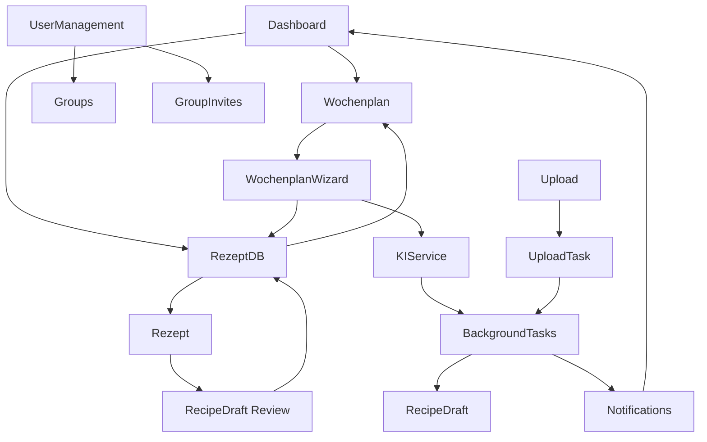

# 🍽️ Meal Planning System – Architektur & Komponenten

## Ziel des Systems

Ziel ist der Aufbau eines modularen, erweiterbaren Meal-Planning-Systems, das folgende Kernprobleme löst:

- Strukturierte Wochenplanung (morgens / mittags / abends)
- Zentrale, editierbare Rezept- & Gerichtedatenbank
- KI-gestützte Generierung neuer Gerichte
- Wiederverwendung & Variation statt Wiederholung
- Automatisierung (Wochenplan-Vorschläge, Generierung, Notifications)
- Transparente Kontrolle für den Nutzer (Review, Austausch, Favoriten)

Das System ist **zustandsgetrieben**, **asynchron** (Background Tasks) und **UI-geführt**, mit klaren Trennungen zwischen:
- Planung
- Rezeptverwaltung
- Generierung
- Review
- Einkauf / Weiterverarbeitung (später)

---

## 🧩 Komponentenübersicht

- Dashboard
- Rezept- / Gerichtedatenbank
- Rezept-Erstellung (Upload & KI)
- Wochenplanverwaltung
- Wochenplan-Erstellung (Wizard)
- Notifications
- Hintergrundverarbeitung
- Review & Validierung

---

## 🧭 Dashboard

### Zweck
Zentraler Einstiegspunkt mit Überblick über:
- Aktuellen Wochenplan
- Schnelle Filter & Favoriten
- Direkter Zugriff auf Details

### Hauptkomponenten
- **Wochenplan-Tabelle**
  - Zeilen: Montag – Sonntag
  - Spalten: Morgens | Mittags | Abends
  - Jede Zelle:
    - Gericht
    - Favoriten-Button
    - Klick → Detailansicht / Austausch

- **Filter**
  - Favorisiert (vom aktuellen User favorisiert)
  - Mahlzeit (Frühstück / Mittag / Abend)
  - Tags

- **Detailbereich (erweitert)**
  - Pro Mahlzeit:
    - Zutaten
    - Zubereitung
    - Dauer
    - Checkbox: Nährwerte anzeigen
    - Favorisieren

### Design-Alternativen
- Split View (Tabelle links, Detail rechts)
- Collapse / Accordion pro Tageszeit
- Mobile: Tageskarten statt Tabelle

---

## 📚 Rezept- / Gerichtedatenbank

### Zweck
Zentrale Verwaltung aller Gerichte (manuell + KI)

### Hauptansicht
**Editierbare Tabelle**

| Spalte | Beschreibung |
|------|-------------|
| Gericht | Name |
| Tags | frei editierbar |
| Mahlzeit | Frühstück / Mittag / Abend (optional, nullable) |
| Source | Generiert / Upload / Manuell |
| Nährwert | pro Portion (aus NutritionInfo) |
| Bewertung | Durchschnitt (aggregiert aus RecipeRatings) |
| Wiederholungszyklus | z. B. alle X Wochen (optional) |
| Aktionen | Edit / Delete |

Jede Zelle ist **Inline-editierbar**.

### Filter
- Mahlzeit (Frühstück / Mittag / Abend)
- Tags
- Source (Generiert / Upload / Manuell)
- Favoriten (vom aktuellen User favorisiert)

### Plus-Button (oben rechts)
→ Öffnet **Rezept-Erstellungsdialog**

---

## ➕ Rezept-Erstellung

### Auswahl-Dialog
Optionen:
- 📄 File Upload (PDF / PNG / mehrere)
- 🤖 KI-Gericht generieren

---

### 🧠 KI-Gericht generieren – Maske

#### Parameter (Dropdowns / Buttons)
- Mahlzeit: Frühstück | Mittag | Abend
- Ernährungsform: vegetarisch | vegan | Fleisch
- Stil: gesund | fettig | Fitness | Low Carb | eiweißreich
- Aufwand:
  - schnell
  - kurze Vorbereitungszeit
  - wiederverwendbare Zutaten
- Tags (frei)
- Spracheingabe (Speech-to-Prompt)

#### Intelligente Rückfragen
Beispiel:
> „Italienisches Gericht“
→ Rückfrage:
- vegetarisch oder Fleisch?
- Frühstück / Mittag / Abend?

---

### 📄 Upload-Flow

- Nutzer lädt Dateien hoch
- **UploadTask** wird erstellt (Status: Pending)
- Background Task startet (Parsing / Extraktion)
- **UploadTask.Status** → Processing
- System blockiert nicht
- Nach Abschluss:
  - **UploadTask.Status** → Completed
  - **RecipeDraft** wird erstellt (Status: Pending)
  - Notification
  - Gericht erscheint im **Review-Zwischenschritt**
- Bei Fehler:
  - **UploadTask.Status** → Failed
  - **UploadTask.Error** enthält Fehlermeldung
  - Notification mit Fehler

---

## 🧐 Review & Validierung

### Zweck
Qualitätssicherung vor Aufnahme in die DB

### Datenbankstruktur
- **RecipeDraft** Entity (Status: Pending, Approved, Rejected)
- Nach Upload/KI-Generierung wird **RecipeDraft** erstellt
- Review-Prozess bearbeitet **RecipeDraft**
- Nach Approval → wird zu **Recipe** konvertiert

### Workflow
- Anzeige extrahierter Daten (aus RecipeDraft)
- Editierbar (Name, Beschreibung, Zutaten, Tags, etc.)
- Warnung bei ähnlichen Gerichten (Ähnlichkeitslogik)
- Entscheidung:
  - ✔ Übernehmen → RecipeDraft.Status = Approved → wird zu Recipe
  - ✏ Anpassen → RecipeDraft bleibt, kann weiter bearbeitet werden
  - ❌ Verwerfen → RecipeDraft.Status = Rejected → wird gelöscht oder archiviert

---

## 🗓️ Wochenplanverwaltung

### Ansicht
- Kalender (Standard: Woche)
- Navigation:
  - ← vorherige Woche
  - → nächste Woche
- Umschaltbar:
  - Woche
  - Monat
  - (später: Jahr)

### Interaktion
- Klick auf Gericht → Austausch
- Austausch-Optionen:
  - aus DB wählen
  - zufällig
  - neu generieren (KI-Maske)

---

## ➕ Wochenplan erstellen (Wizard)

### Schritt 1 – Zeitraum
- Laufzeit des aktuellen Plans
- Neuer Zeitraum (prefilled: nächste Woche)
- **Hinweis:** Aktuell auf 7 Tage beschränkt (Wochenplan), später flexibel erweiterbar

---

### Schritt 2 – Mahlzeiten auswählen
Buttons:
- Frühstück
- Mittag
- Abend

Option:
- Für alle Tage?
  - Ja → fertig
  - Nein → Auswahlmatrix (Mo–So × Mahlzeiten)

---

### Schritt 3 – Rezeptquelle
Buttons:
- Nur aus DB
- Nur neue Gerichte
- Beides

Falls Beides:
- Verteilung:
  - ⅓ neu / ⅔ DB
  - 50 / 50
  - ⅔ neu / ⅓ DB
- Stil:
  - ähnlich (Tags, Zutaten-Overlap)
  - neue Ideen (abweichende Tags, neue Zutaten)
- **DB-Auswahl-Logik:**
  - Zufällig aus verfügbaren Rezepten
  - Gewichtet nach Favoriten (vom aktuellen User)
  - Berücksichtigt Wiederholungszyklus (RepeatCycleWeeks)
  - Filtert nach Tags/Mahlzeit

---

### Schritt 4 – Generierungsparameter
- Gleiche Maske wie Rezept-Erstellung
- Optional abgespeckt

---

### Ergebnis
- **MealPlan** wird erstellt (Status: Draft)
- Wochenplan wird **asynchron** erstellt
- **MealPlanEntries** werden erstellt
- Notification
- Vorschau
- Manuelles Nachjustieren pro Tag / Mahlzeit
- Nach Bestätigung: **MealPlan.Status** → Active

---

## 🔔 Notifications

### Typen
- Upload abgeschlossen (UploadTask.Status = Completed)
- Upload fehlgeschlagen (UploadTask.Status = Failed)
- KI-Generierung abgeschlossen
- Neuer Wochenplan verfügbar (MealPlan.Status = Active)
- Warnung bei ähnlichen Rezepten (bei Review)

### Datenbankstruktur
- **Notification** Entity (Type, Message, IsRead, ReadAt)
- Pro User (UserId)
- Optional: ActionLink (z.B. RecipeDraft ID, MealPlan ID)

### UI
- Bell Icon in Menüleiste
- Badge Counter (ungelesene Notifications)
- Liste mit Mark-as-Read-Funktion

---

## ⚙️ Hintergrundverarbeitung

### Tasks
- File Parsing (UploadTask)
- KI-Generierung (asynchron)
- Ähnlichkeitsanalyse (on-the-fly oder Background Task)
- Wochenplan-Automatisierung

### Status-Tracking
- **UploadTask** Entity für Upload-Status (Pending, Processing, Completed, Failed)
- Nicht-blockierend, Status-basiert
- Fehlerbehandlung mit Error-Message

---

## 🔁 Automatisierungen

### Automatische Wochenplan-Erstellung
- **Trigger:** X Tage vor Ende des aktuellen MealPlans (Status: Active)
- **Parameter:**
  - bevorzugte Mahlzeiten
  - Variation
  - Favoritengewichtung
  - Wiederholungszyklus-Berücksichtigung
- **Hinweis:** Aktuell Backend-Konfiguration, später optional: AutomationRule Entity für User-Konfiguration

---

## 🧠 Ähnlichkeitslogik

### Berechnung
- Zutaten-Overlap (RecipeIngredients.Name)
- Tags (RecipeTags)
- Zubereitungsart (Instructions-Ähnlichkeit)
- **Hinweis:** Aktuell on-the-fly berechnet, später optional: RecipeSimilarity Entity für Caching

### Verhalten
- Warnung statt Blockade (bei Review)
- Ähnlichkeits-Score (0-100%)
- Anzeige ähnlicher Rezepte im Review-Dialog

---

## 👥 User-Management & Gruppen

### Gruppen-Verwaltung
- **Gruppen erstellen:** Admin kann neue Gruppen erstellen
- **User einladen:** Admin erstellt GroupInvite (Token, Email)
- **Beitritt:** User akzeptiert Einladung via Token
- **Rollen:** Admin (volle Rechte) vs. Member (Standard-Rechte)

### UI-Komponenten (später)
- Gruppen-Verwaltungsseite
- Einladungs-Dialog
- Mitglieder-Liste
- Rollen-Verwaltung

---

## ✏️ Rezept-Bearbeitung

### Bearbeitungsmodi
- **Inline-Editierung:** Direkt in der Tabelle (Name, Tags, Mahlzeit, etc.)
- **Detail-Dialog:** Vollständige Bearbeitung (Zutaten, Zubereitung, Nährwerte)

### Validierung
- Name ist required
- Tags müssen existieren oder werden erstellt
- Zutaten müssen Name haben

### Versionierung
- **Hinweis:** Aktuell keine Versionierung, später optional

---

## 🗑️ Rezept-Löschung

### Lösch-Logik
- **Hard Delete:** Rezept wird aus DB gelöscht
- **MealPlanEntries:** RecipeId wird auf null gesetzt (SetNull), Entry bleibt mit CustomMealName
- **Cascade Delete:** RecipeIngredients, RecipeTags, RecipeRatings, NutritionInfo werden gelöscht

### Bestätigung
- Dialog: "Rezept löschen? Dies kann nicht rückgängig gemacht werden."
- Warnung: "X MealPlanEntries werden betroffen sein."

---

## 📐 UML – Systemübersicht

---

## 🧩 Erweiterbarkeit (bewusst offen)

Einkaufsliste (Ableitung aus Wochenplan)

Nährwert-Tracking

Meal-Prep-Optimierung

Budget-basierte Planung

Household / Multi-User